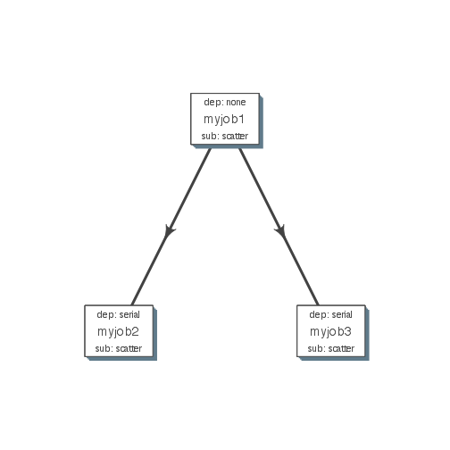
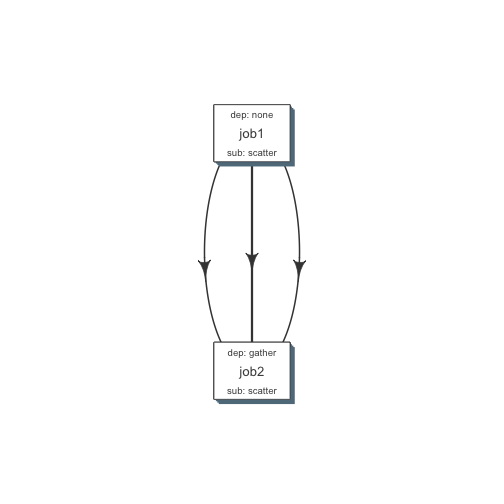
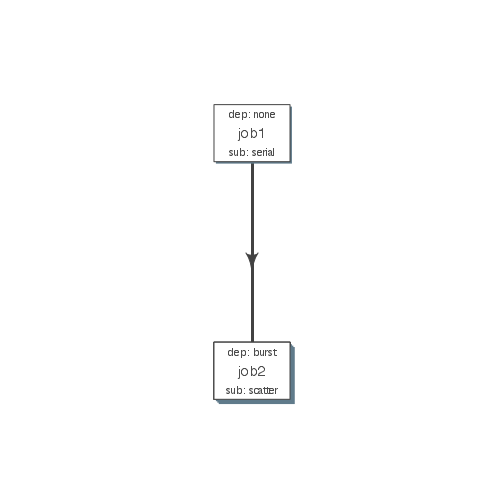

Currently we support LSF and Torque (SGE). 


```r
qobj <- queue(type = "lsf", queue = "normal", verbose = FALSE)
```

### Simple flow
- Each module here has a single job
- job2 and job3 would start after 1 is complete

```r
job1 <- job(name = "myjob1", cmds = "sleep1", q_obj = qobj)
job2 <- job(name = "myjob2", cmds = "sleep2", q_obj = qobj, previous_job = "myjob1", dependency_type = "serial")
job3 <- job(name = "myjob3", cmds = "sleep3", q_obj = qobj, previous_job = "myjob1", dependency_type = "serial")
fobj <- flow(name = "myflow", jobs = list(job1, job2, job3), desc="description")
plot_flow(fobj)
```

 


```r
dat <- flowr:::.create_jobs_mat(fobj)
knitr:::kable(dat)
```


|       |jobname |prev_jobs |dep_type |sub_type |cpu_reserved |nodes | jobid| prev_jobid|
|:------|:-------|:---------|:--------|:--------|:------------|:-----|-----:|----------:|
|myjob1 |myjob1  |          |none     |scatter  |1            |1     |     1|         NA|
|myjob2 |myjob2  |myjob1    |serial   |scatter  |1            |1     |     2|          1|
|myjob3 |myjob3  |myjob1    |serial   |scatter  |1            |1     |     3|          1|


### Submission types
- scatter: submit all commands as parallel independent jobs
- serial: run these commands sequentuially one after the other

### Dependency types
- none: independent job
- serial: *one to one* relationship with previous job
- gather: *many to one* wait for **all** commands in previous job to finish then start current


##### Serial: one to one relationship
- All commads in 'job1' are submitted, and those is 'jobs2' *wait* for those in 'job1' to complete.
- Commands in 'job2' are serially dependent on 'job1'
- Both jobs are submitted as parallel (*scatter*), i.e. there is not **intra** dependency.
- so previous job submission: `scatter`, and current job's dependency type `serial`

```r
cmds = rep("sleep 5", 10)
jobj1 <- job(q_obj=qobj, cmd = cmds, submission_type = "scatter", name = "job1")
jobj2 <- job(q_obj=qobj, name = "job2", cmd = cmds, submission_type = "scatter", 
             dependency_type = "serial", previous_job = "job1")
fobj <- flow(jobs = list(jobj1, jobj2))
plot_flow(fobj)
```

 

##### Gather: many to one relationship
- makes sense when previous job had many commands running in parallel and current job would wait for all
- so previous job submission: `scatter`, and current job's dependency type `gather`

```r
jobj1 <- job(q_obj=qobj, cmd = cmds, submission_type = "scatter", name = "job1")
jobj2 <- job(q_obj=qobj, name = "job2", cmd = cmds, submission_type = "scatter", 
             dependency_type = "gather", previous_job = "job1")
fobj <- flow(jobs = list(jobj1, jobj2))
plot_flow(fobj)
```

 

##### Burst: one to many relationship
- makes sense when previous job had one command current job would split and submit several jobs in parallel
- so previous job submission_type: `serial`, and current job's dependency type `burst`, with a submission type: `scatter`

```r
jobj1 <- job(q_obj=qobj, cmd = cmds, submission_type = "serial", name = "job1")
jobj2 <- job(q_obj=qobj, name = "job2", cmd = cmds, submission_type = "scatter", 
             dependency_type = "burst", previous_job = "job1")
fobj <- flow(jobs = list(jobj1, jobj2))
plot_flow(fobj)
```

 


For more details look at [Building flowr recepies](buid_main.html)
