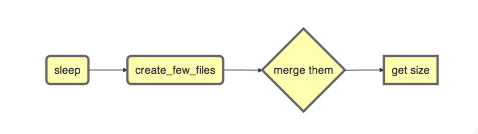

```{r libs, echo = FALSE, message = FALSE}
library(knitr)
library(flowr)
```

# Get started


```{r, message=FALSE}
library(flowr)
```

```{r eval=FALSE}
setup()
```
This will copy the flowr helper script to `~/bin`. Please make sure that this folder is in your `$PATH` variable.

<!---We have a quite handy command-line-interface for flowr, which exposes all functions of the package to terminal. Such that we dont have to open a interactive R session each time. To make this work, run a setup function which copies the 'flowr' helper script to your `~/bin` directory. ---> 

Running flowr from the terminal will fetch you the following:

```
Usage: flowr function [arguments]

  run             Running predefined pipelines; try flowr avail x="pipelines"
  fetch_pipes     Checking what modules and pipelines are available; avail x=modules OR avail x=pipelines
  status          Detailed status of a flow (s).
  rerun           rerun a previously failed flow
  kill            Kill the flow, upon providing working directory

Please use 'flowr function -h' to obtain further information about the usage.
```

<!--If you would like to do a test drive on its other capabilities, here are a [few examples](https://github.com/sahilseth/rfun).-->

```
## run the following to confirm that ~/bin is added your PATH variable:
echo $PATH
## if ~/bin is not in your path, run and add the following to your ~/.bashrc
export PATH=$PATH:~/bin
## now run the following from the terminal, to check if setup worked fine.
flowr
```

## Toy example


```{r, message=FALSE, echo=FALSE, fig.height=1.5, fig.width=5, eval=FALSE}
library(DiagrammeR)
mermaid("
graph LR
A(sleep)-->B(create_few_files) 
B-->C{merge them}
C-->D[get size]
")
```




```{r echo=FALSE, message=FALSE}
ex = file.path(system.file(package = "flowr"), "pipelines")
flow_mat = as.flowmat(file.path(ex, "sleep_pipe.tsv"))
flow_def = as.flowdef(file.path(ex, "sleep_pipe.def"))
```

Consider, a simple example where we have **three** instances of the `sleep` command running ( which basically stalls the terminal for few seconds and does nothing ). After its completion **three** tmp files are created with some random data. After this, a merge step follows, which combines them into one big file. Next we use `du` to calculate the size of the resulting file. This flow is shown in the above described figure.

<div class="alert alert-info" role="alert">
**NGS context** This is quite similar in structure to a typical workflow from where a series of alignment and sorting steps may take place on the raw fastq files. Followed by merging of the resulting bam files into one large file per-sample and further downstream processing.
</div>

To create this flow in flowr, we need the actual commands to run; and some kind of a configuration file to describe which ones go first.

Here is a table with the commands we would like to run ( or `flow mat` ).

```{r echo=FALSE}
kable(flow_mat)
```

Further, we use an additional file specifying the relationship between the steps, and also other resource requirements: [flow_def](http://docs.flowr.space/en/latest/rd/vignettes/build-pipes.html#flow-definition). Each row in a flow mat relates to one job. 


<div class="alert alert-info" role="alert">
Notice how jobname column is being used a key throught the two tables. And how prev_jobs (previous jobs) defines what jobs need to 
complete before the one described in that row starts.
</div>

```{r, message=FALSE, echo=FALSE}
kable(flow_def)
```


## Stitch it

We use the two files descirbed above and stich them to create a `flow object`, which contains all the information we
need for submission to the cluster. Additionally we can give a name to this flow, using flowname argument and also override the 
platform described in `flow def`. Look at `to_flow` [help file](docs.flowr.space/rd.html#to_flow) for more information.

```{r, message=FALSE}
fobj <- to_flow(x = flow_mat, def = as.flowdef(flow_def), 
	flowname = "example1", platform = "lsf")
```

## Plot it

We can use `plot_flow` to quickly visualize the flow; this really helps when developing complex workflows. 
Additionally, this function also works on 
the `flow definition` table as well (`plot_flow(flow_def`).

```{r plotit, fig.cap="Flow chart describing process for example 1", message=FALSE}
plot_flow(fobj) # ?plot_flow for more information
```


## Dry Run

<div class="alert alert-info" role="alert">
<b>Dry run</b>: Quickly perform a dry run, of the submission step. This creates all the folder and files, and skips submission 
to the cluster. User's may spend some time checking the `*.sh` files for each of the jobs along with pdf of the flow etc.
</div>

```{r eval=FALSE}
submit_flow(fobj)
```

```
Test Successful!
You may check this folder for consistency. Also you may re-run submit with execute=TRUE
 ~/flowr/type1-20150520-15-18-27-5mSd32G0
```

## Submit it

<div class="alert alert-info" role="alert">
Submit to the cluster !
</div>


```{r eval=FALSE}
submit_flow(fobj, execute = TRUE)
```

```
Flow has been submitted. Track it from terminal using:
flowr::status(x="~/flowr/type1-20150520-15-18-46-sySOzZnE")
OR
flowr status x=~/flowr/type1-20150520-15-18-46-sySOzZnE
```


## Check its status

One may periodically run `status` to monitor the status of a flow.

<div class="alert alert-info" role="alert">
<b>Note</b>: Please make sure to include `x=~` in status, to 
expicitly define the variable. Also unlike other command line tools
you may skip adding "-" in from of each argument ( no need of `-x=~`).
</div>

```
flowr status x=~/flowr/type1-20150520-15-18-46-sySOzZnE

Showing status of: /rsrch2/iacs/iacs_dep/sseth/flowr/type1-20150520-15-18-46-sySOzZnE
|          | total| started| completed| exit_status|    status|
|:---------|-----:|-------:|---------:|-----------:|---------:|
|001.sleep |    10|      10|        10|           0| completed|
|002.tmp   |    10|      10|        10|           0| completed|
|003.merge |     1|       1|         1|           0| completed|
|004.size  |     1|       1|         1|           0| completed|
```

Alternatively, to check a summarized status of several flows, skip the full path, and mention 
only the parent direcotry, for example:

```
flowr status x=~/flowr/type1-20150520-15-18-46-sySOzZnE

Showing status of: /rsrch2/iacs/iacs_dep/sseth/flowr/type1-20150520-15-18-46-sySOzZnE
|          | total| started| completed| exit_status|    status|
|:---------|-----:|-------:|---------:|-----------:|---------:|
|001.sleep |    30|      30|        10|           0|processing|
|002.tmp   |    30|      30|        10|           0|processing|
|003.merge |     3|       3|         1|           0|   pending|
|004.size  |     3|       3|         1|           0|   pending|
```

<div class="alert alert-success" role="alert">
<b>Scalability</b>: Quickly submit, and check a summarized OR detailed status on ten or hundreds of 
flows.
</div>

## Kill it

Incase something goes wrong, one may use to kill command to terminate all the relating jobs.


kill one flow:
```
flowr kill_flow x=flow_wd
```

<div class="alert alert-warning" role="alert">
One may instruct flowr to kill multiple flows,  but flowr would confirm before killing.
</div>

```
kill(x='fastq_haplotyper*')
Flowr: streamlining workflows
found multiple wds:
./fastq_haplotyper-MS132-20150825-16-24-04-0Lv1PbpI
/fastq_haplotyper-MS132-20150825-17-47-52-5vFIkrMD
Really kill all of them ? kill again with force=TRUE
```

To kill multiple, set force=TRUE:
```
kill(x='fastq_haplotyper*', force = TRUE)
```

<div class="alert alert-warning" role="alert">
While submission is in progress, and you figure, you want to kill the flow; its best to let `submit_flow` do its job, 
when done simply use `kill(flow_wd)`. 
If `submit_flow` is interrupted, files with details regarding job ids etc are not created, thus flowr can't associate 
submitted jobs with flow instance ( hence can't kill them ). In such a situation you may resort to killing them manually.
</div>

```
## manual killing:
jobids=$(qstat | grep 'mypattern')
qdel $jobids

```

## Re-run a flow

flowr also enables you to re-run a pipeline in case of hardware or software failures.

- **hardware failure**: no change to the pipeline is required, simply rerun it: `rerun(x=flow_wd, start_from=<intermediate step>)`
- **software failure**: either a change to flowmat or flowdef has been made: `rerun(x=flow_wd, mat = new_flowmat, def = new_flowdef, start_from=<intermediate step>)`

In either case there are two things which are always required, a `flow_wd` 
(the folder created by flowr which contains execution logs) and name of the step from where 
we want to start execution. 
Refer to the [help section](http://docs.flowr.space/en/latest/rd/topics/complete-help.html) for more details.


# Ingredients for building a pipeline

An easy and quick way to build a workflow is create to create a set of two tab delimited files. First is a table with commands to run (for each module of the pipeline), while second has details regarding how the modules are stitched together. In the rest of this document we would refer to them as flow_mat and flow_def respectively (as introduced in the above sections).

We could read in, examples of both of these files to understand their structure.

```{r build_pipe_exdata, message=FALSE}
## ------ load some example data
ex = file.path(system.file(package = "flowr"), "pipelines")
flow_mat = as.flowmat(file.path(ex, "sleep_pipe.tsv"))
flow_def = as.flowdef(file.path(ex, "sleep_pipe.def"))
```

> Both these files have a `jobname` column connects them to each other.

```{r build_pipe_ex1, eval=FALSE, echo=FALSE}
#flow_def = read_sheet(file.path(exdata, "example1_flow_def2.txt"))
fobj = suppressMessages(to_flow(flow_mat, def = flow_def, platform = "torque"))
fobj@jobs[[1]]@nodes
#debug(submit_flow)
fobj = submit_flow(fobj)
```


## 1. Flow mat

> describes commands to run.

Each row in flow mat describes one shell command, with additional information regarding the name of the step etc.

Essentially, this is a tab delimited file with three columns:

- `samplename`: A grouping column. The table is split using this column and each subset is treated as an individual flow. 
Thus we may have one flowmat for a series of samples, and the whole set would be submitted as a batch.
	- If all the commands are for a single sample, one can just repeat a dummy name like sample1 all throughout.
- `jobname`: This corresponds to the name of the step. This should match exactly with the jobname column in flow_def table described below.
- `cmd`: A shell command to run. One can get quite creative here. These could be multiple shell commands separated by a `;` or `&&`, more on this [here](http://stackoverflow.com/questions/3573742/difference-between-echo-hello-ls-vs-echo-hello-ls). Though to keep this clean you may just wrap a multi-line command into a script and just source the bash script from here.

Here is an example [flow_mat](https://github.com/sahilseth/flowr/blob/master/inst/pipelines/sleep_pipe.tsv) for the 
flowr described above.


```{r build_pipe_exmat, echo=FALSE}
kable(subset(flow_mat, samplename == "sample1"))
```

## 2. Flow definition

> defines how to stich pieces of the (work)flow

Each row in this table refers to one step of the pipeline. 
It describes the resources used by the step and also its relationship with other steps, especially, the step immediately prior to it.


It is a tab separated file, with a minimum of 4 columns:

- `jobname`: Name of the step
- `sub_type`: Short for [submission type](#submission-types), refers to, how should multiple commands of this step be submitted. Possible values are `serial` or `scatter`. 
- `prev_job`: Short for previous job, this would be jobname of the previous job. This can be NA/./none if this is a independent/initial step, and no previous step is required for this to start. 
- `dep_type`: Short for [dependency type](#dependency-type), refers to the relationship of this job with the one defined in `prev_job`. This can take values `none`, `gather`, `serial` or `burst`.

These would be explained in detail, below.

Apart from the above described variables, several others defining the resource requirements of each step are also available. These give great amount of flexibility to the user in choosing CPU, wall time, memory and queue for each step (and are passed along to the HPCC platform). 

- `cpu_reserved`
- `memory_reserved`
- `nodes`
- `walltime`
- `queue`

<div class="alert alert-info" role="alert">
This is especially useful for genomics pipelines, since each step may use different amount of resources. For example, in a typical setup, if one step uses 16 cores these would be blocked and not used during processing of several other steps. Thus resulting in blockage and high cluster load (even when actual CPU usage may be low). Being able to tune them, makes this setup quite efficient.
</div>

Most cluster platforms accept these resource arguments. Essentially a file like [this](https://github.com/sahilseth/flowr/blob/master/inst/conf/torque.sh) is used as a template, and variables defined in curly braces ( ex. `{{{CPU}}}` ) are filled up using the flow definition file.

<div class="alert alert-info" role="alert">
If these (resource requirements) columns are not included in the flow definition, their values should be explicitly defined in the [submission template](https://github.com/sahilseth/flowr/blob/master/inst/conf).
One may customize the templates as described in the [cluster support](#cluster-support) section below.
</div>


Here is an example of a typical [flow_def](https://raw.githubusercontent.com/sahilseth/flowr/master/inst/pipelines/sleep_pipe.def) file.


```{r build_pipe_exdef, echo=FALSE}
kable(head(flow_def))
```


<!-- Each row of this table translates to a call to ([job](http://docs.flowr.space/build/html/rd/topics/job.html) or) [queue](http://docs.flowr.space/build/html/rd/topics/queue.html) function. -->

<!-- 
- jobname: is passed as `name` argument to job().
- prev_jobs: passed as `previous_job` argument  to job().
- dep_type: passed as `dependency_type` argument  to job(). Possible values: gather, serial
- sub_type: passed as `submission_type` argument  to job().
- queue: name of the queue to be used for this particular job. 
	Since each jobs can be submitted to a different queue, this makes your flow very flexible
- memory_reserved: Refer to your system admin guide on what values should go here. 
	Some pipelines: 160000, 16g etc representing a 16GB reservation of RAM
- walltime: How long would this job run. Again refer to your HPCC guide. Example: 24:00, 24:00:00
- cpu_reserved: Amount of CPU reserved.

Its best to have this as a tab seperated file (with no row.names). -->

<!---
### Style 2

This style may be more suited for people who like to explore more advanced usage and like to code in R. Also this one find this much faster if jobs and their relationships changes a lot.

Here instead of seperating cmds and definitions one defines them step by step incrementally.

- Use: queue(), to define the computing cluster being used
- Use: multiple calls job()
- Use: flow() to stich the jobs into a flow.


Currently we support LSF, Torque and SGE. Let us use LSF for this example.

```{r getqobj, eval=FALSE}
qobj <- queue(platform = "lsf", queue = "normal", verbose = FALSE)
```

Let us stitch a simple flow with three jobs, which are submitted one after the other.

```{r plot_simpleflow, eval=FALSE}
job1 <- job(name = "myjob1", cmds = "sleep1", q_obj = qobj)
job2 <- job(name = "myjob2", cmds = "sleep2", q_obj = qobj, previous_job = "myjob1", dependency_type = "serial")
job3 <- job(name = "myjob3", cmds = "sleep3", q_obj = qobj, previous_job = "myjob1", dependency_type = "serial")
fobj <- flow(name = "myflow", jobs = list(job1, job2, job3), desc="description")
plot_flow(fobj)
```

The above translates to a flow definition which looks like this:

```{r, eval=FALSE}
dat <- flowr:::create_jobs_mat(fobj)
knitr:::kable(dat)
```
--->


# Submission types

### Example:

A   ----> B  -----> C -----> D

Consider an example with three steps A, B and C. A has 10 commands from A1 to A10, similarly B has 10 commands B1 through B10 and C has a single command, C1.

Consider another step D (with D1-D3), which comes after C.

> *This refers to the sub_type column in flow definition.*

- `scatter`: submit all commands as parallel, independent jobs. 
	- *Submit A1 through A10 as independent jobs*
- `serial`: run these commands sequentially one after the other. 
	- *Wrap A1 through A10, into a single job.*

# Dependency types

> *This refers to the dep_type column in flow definition.*

- `none`: independent job. 
	- *Initial step A has no dependency*
- `serial`: *one to one* relationship with previous job. 
	- *B1 can start as soon as A1 completes.*
- `gather`: *many to one*, wait for **all** commands in previous job to finish then start the  current step. 
	- *All jobs of B (1-10), need to complete before C1 is started*
- `burst`: *one to many* wait for the previous step which has one job and start processing all cmds in the current step. 
	- *D1 to D3 are started as soon as C1 finishes.*


# Relationships

Using the above submission and dependency types one can create several types of relationships between former and later jobs. Here are a few pipelines of relationships one may typically use.


## Serial: one to one relationship

[scatter] ---serial---> [scatter]

A is submitted as scatter, A1 through A10. Further B1, requires A1 to complete; B2 requires A2 and so on, but they need not wait for all of step A jobs to complete. Also B1 through B10 are independent of each other.

To set this up, A and B would have `sub_type` `scatter` and B would have `dep_type` as `serial`. Further, since A is an initial step its `dep_type` and `prev_job` would defined as `none`.

```{r plot_one_one, echo=FALSE, message=FALSE}
qobj <- queue(platform = "lsf", queue = "normal", verbose = FALSE)
A <- job(name = "A", cmds = "sleep1", q_obj = qobj, 
				 submission_type = "scatter")
B <- job(name = "B", cmds = "sleep2", q_obj = qobj,
				 previous_job = "A", 
				 dependency_type = "serial", submission_type = "scatter")
C <- job(name = "C", cmds = "sleep2", q_obj = qobj,
				 previous_job = "B", 
				 dependency_type = "gather", submission_type = "serial")
D <- job(name = "D", cmds = "sleep2", q_obj = qobj,
				 previous_job = "C", 
				 dependency_type = "burst", submission_type = "scatter")

pab <- plot_flow(flow(jobs = list(A, B)))
```

## Gather: many to one relationship

[scatter] ---gather---> [serial]

Since C is a single command which requires all steps of B to complete, intuitively it needs to `gather` pieces of data generated by B. In this case `dep_type` would be `gather` and `sub_type` type would be `serial` since it is a single command.

```{r plot_many_one, echo=FALSE, message=FALSE, eval=FALSE}
pbc <- plot_flow(flow(jobs = list(B, C)))
```

<!---
- makes sense when previous job had many commands running in parallel and current job would wait for all
- so previous job submission: `scatter`, and current job's dependency type `gather`
```{r, eval=FALSE, echo=FALSE}
jobj1 <- job(q_obj=qobj, cmd = cmds, submission_type = "scatter", name = "job1")
jobj2 <- job(q_obj=qobj, name = "job2", cmd = cmds, submission_type = "scatter", 
             dependency_type = "gather", previous_job = "job1")
fobj <- flow(jobs = list(jobj1, jobj2))
plot_flow(fobj)
```
--->

## Burst: one to many relationship

[serial] ---burst---> [scatter]


Further, D is a set of three commands (D1-D3), which need to wait for a single process (C1) to complete. They would be submitted as `scatter` after waiting on C in a `burst` type dependency.

```{r plot_one_many, echo=FALSE, message=FALSE, eval=FALSE}
pcd <- plot_flow(flow(jobs = list(C, D)))
```


<!---
- makes sense when previous job had one command current job would split and submit several jobs in parallel
- so previous job submission_type: `serial`, and current job's dependency type `burst`, with a submission type: `scatter`
```{r, eval=FALSE, echo=FALSE}
jobj1 <- job(q_obj=qobj, cmd = cmds, submission_type = "serial", name = "job1")
jobj2 <- job(q_obj=qobj, name = "job2", cmd = cmds, submission_type = "scatter", 
             dependency_type = "burst", previous_job = "job1")
fobj <- flow(jobs = list(jobj1, jobj2))
plot_flow(fobj)
```
--->

In essence and example flow_def would look like as follows (with additional resource requirements not shown for brevity).


```{r plot_abcd, message=FALSE}
ex2def = as.flowdef(file.path(ex, "abcd.def"))
ex2mat = as.flowmat(file.path(ex, "abcd.tsv"))
fobj = suppressMessages(to_flow(x = ex2mat, def = ex2def))
kable(ex2def[, 1:4])
plot_flow(fobj)
```

<div class="alert alert-info" role="alert">
There is a darker more prominent shadow to indicate 
scatter steps.
</div>

## Passing of flow definition resource columns

The resource requirement columns of flow definition are passed along to the final (cluster) submission script. 
For example values in the `cpu_reserved` column would be populated in the `{{{CPU}}}` submission template.

The following table provides a mapping between the flow definition columns and variables in the submission templates:


```{r build_pipe_flow_def_cols, echo=FALSE, message=FALSE}
#extdata = file.path(system.file(package = "flowr"), "extdata")
mat = params::read_sheet("files/flow_def_columns.txt")
kable(mat, col.names = c("flowdef variable", "submission template variable"))
```

`* These are generated on the fly` and `** This is gathered from flow mat`


# Available Pipelines

Here are some of the available pipelines along with their respective locations

```{r echo=FALSE, results='asis', message=TRUE, eval=FALSE}

pipes = try(fetch_pipes(silent = TRUE))
#message(pipes)
if(class(pipes) != "try-error")
	if(nrow(pipes) > 0){
		pipes$pipe = basename(pipes$pipe)
		pipes$def = basename(pipes$def)
		pipes$conf = basename(pipes$conf)
		params::kable(pipes)
	}

```


# Cluster Support

Support for several popular cluster platforms are built-in. There is a template, for each platform, which should would out of the box.
Further, one may copy and edit them (and save to `~/flowr/conf`) in case some changes are required. Templates from this folder (`~/flowr/conf`), would override defaults.

Here are links to latest templates on github:

- [torque](https://github.com/sahilseth/flowr/blob/master/inst/conf/torque.sh)
- [lsf](https://github.com/sahilseth/flowr/blob/master/inst/conf/lsf.sh)
- [moab](https://github.com/sahilseth/flowr/blob/master/inst/conf/moab.sh)
- [sge](https://github.com/sahilseth/flowr/blob/master/inst/conf/sge.sh)
- [slurm](https://github.com/sahilseth/flowr/blob/master/inst/conf/slurm.sh), needs testing


As of now we have tested this on the following clusters:

```{r echo=FALSE}
#exdata = file.path(system.file(package = "flowr"), "extdata")
plat <- params::read_sheet("files/platforms_supported.txt", id_column = "Platform")
kable(plat)
```

\*queue short-name used in [flow](https://github.com/sahilseth/flow)


- PBS: [wiki](http://en.wikipedia.org/wiki/Portable_Batch_System)
- Torque: [wiki](http://en.wikipedia.org/wiki/TORQUE_Resource_Manager)
	- MD Anderson
	- [University of Houston](http://www.rcc.uh.edu/hpc-docs/49-using-torque-to-submit-and-monitor-jobs.html)
- LSF [wiki](http://en.wikipedia.org/wiki/Platform_LSF):
	- Harvard Medicla School uses: [LSF HPC 7](https://wiki.med.harvard.edu/Orchestra/IntroductionToLSF)
	- Also Used at [Broad](https://www.broadinstitute.org/gatk/guide/article?id=1311)
- SGE [wiki](http://en.wikipedia.org/wiki/Sun_Grid_Engine)
	- A tutorial for [Sun Grid Engine](https://sites.google.com/site/anshulkundaje/inotes/programming/clustersubmit/sun-grid-engine)
	- Another from [JHSPH](http://www.biostat.jhsph.edu/bit/cluster-usage.html)
	- Dependecy info [here](https://wiki.duke.edu/display/SCSC/SGE+Job+Dependencies)

[Comparison_of_cluster_software](http://en.wikipedia.org/wiki/Comparison_of_cluster_software)

## Adding a new platform
Adding a new platform involves [a few steps](https://github.com/sahilseth/flowr/issues/7), briefly we need to consider the following steps where changes would be necessary.

1. **job submission**: One needs to add a new template for the new platform. Several [examples](https://github.com/sahilseth/flowr/blob/master/inst/conf) are available as described in the previous section.
2. **parsing job ids**: flowr keeps a log of all submitted jobs, and also to pass them along as a dependency to subsequent jobs. This is taken care by the [parse_jobids()](https://github.com/sahilseth/flowr/blob/master/R/parse-jobids.R) function. Each job scheduler shows the jobs id, when you submit a job, but each shows it in a slightly different pattern. To accommodate this one can use regular expressions as described in the relevant section of the [flowr config](https://github.com/sahilseth/flowr/blob/master/inst/conf/flowr.conf).

For example LSF may show a string such as:

```
Job <335508> is submitted to queue <transfer>.
```

```
jobid="Job <335508> is submitted to queue <transfer>."
set_opts(flow_parse_lsf = ".*(\<[0-9]*\>).*  ")
parse_jobids(jobid, platform="lsf")
[1] "335508"
```

In this case *335508* was the job id and regex worked well !

3. **render dependency**: After collecting job ids from previous jobs, flowr renders them as a dependency for subsequent
jobs. This is handled by [render_dependency.PLATFORM](https://github.com/sahilseth/flowr/blob/master/R/render-dependency.R) functions.
4. **recognize new platform**: Flowr needs to be made aware of the new platform, for this we need to add a new class using the platform name. This is essentially a wrapper around the [job class](https://github.com/sahilseth/flowr/blob/master/R/class-def.R)

Essentially this requires us to add a new line like: `setClass("torque", contains = "job")`.


5. **killing jobs**: Just like submission flowr needs to know what command to use to kill jobs. This is defined in detect_kill_cmd function.

<div class="alert alert-info" role="alert">
There are several [job scheduling](http://en.wikipedia.org/wiki/Job_scheduler) systems
available and we try to support the major players. Adding support is
quite easy if we have access to them. Your favourite not in the list?
re-open this issue, with details on the platform:
[adding platforms](https://github.com/sahilseth/flowr/issues/7)
</div>


