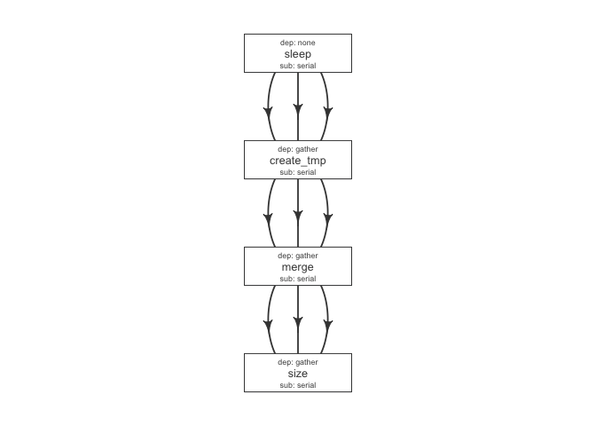

# flowr
Sahil Seth  
`r Sys.Date()`  


# Tutorial: building a pipeline


A pipeline consists of several pieces, most essential of which is a function which generates a [flowmat](http://docs.flowr.space/docs.html#flow_mat).
Additionally, we need a [flow definition](http://docs.flowr.space/docs.html#flow_definition), which descibes flow of the pipeline. 
These three files are available under the [pipelines](https://github.com/sahilseth/flowr/tree/master/inst/pipelines) folder on github.

```
|--- sleep_pipe.R      A R script, with function sleep_pipe(); which creates a flowmat
|--- sleep_pipe.def    A tab-delimited flow definition file, describing the flow of this pipeline
|--- sleep_pipe.conf   An *optional* tab-delimited configuration file, defining default parameters
```


To run the aforementioned pipeline, we would follow through these steps:


```r
load_opts("sleep_pipe.conf") ## optionally, load default parameters
source("sleep_pipe.R") ## get sleep_pipe() function
flowmat = sleep_pipe() ## create a flowmat
flowdef = as.flowdef("sleep_pipe.def") ## read a flow definition.
fobj = to_flow(flowmat, flowdef, execute = TRUE) ## create flow and submit to cluster

## OR assuming we have these three files in the ~/pipelines folder:
fobj = run("sleep_pipe", execute = TRUE); 
```


## Creating Modules/Pipelines


<div class="alert alert-info" role="alert">
**module** A R function which creates a flow mat, is a module. Using `module + flowdef`, we can run a pipeline.
</div>


The `sleep_pipe` calls the three other functions (**modules**); fetches flowmat from each, then rbinds them,
creating a larger flowmat. You may refer to the [sleep_pipe.R](https://github.com/sahilseth/flowr/blob/master/inst/pipelines/sleep_pipe.R)
file for the source.


```r
#' @param x number of files to make
sleep_pipe <- function(x = 3, samplename = "samp1"){

	## call the modules one by one...
	out_sleep = sleep(x, samplename)
	out_create_tmp = create_tmp(x, samplename)
	out_merge_size = merge_size(out_create_tmp$outfiles, samplename)

	## row bind all the commands
	flowmat = rbind(out_sleep$flowmat,
		out_create_tmp$flowmat,
		out_merge_size$flowmat)

	return(list(flowmat = flowmat, outfiles = out_merge_size$outfiles))
}
```


```r
## create a flow matrix
out = sleep_pipe(x = 3, "sample1")
flowmat = out$flowmat
```


samplename   jobname      cmd                                                            
-----------  -----------  ---------------------------------------------------------------
sample1      sleep        sleep 1 && sleep 6;echo 'hello'                                
sample1      sleep        sleep 16 && sleep 10;echo 'hello'                              
sample1      sleep        sleep 7 && sleep 6;echo 'hello'                                
sample1      create_tmp   head -c 100000 /dev/urandom > sample1_tmp_1                    
sample1      create_tmp   head -c 100000 /dev/urandom > sample1_tmp_2                    
sample1      create_tmp   head -c 100000 /dev/urandom > sample1_tmp_3                    
sample1      merge        cat sample1_tmp_1 sample1_tmp_2 sample1_tmp_3 > sample1_merged 
sample1      size         du -sh sample1_merged; echo 'MY shell:' $SHELL                 


Next, we need a flow definition.

## Creating Flow Definition

flowr enables us to quickly create a skeleton flow definition using a flowmat, which we can then alter to suit our needs. A handy function
to_flowdef, accepts a `flowmat` and creates a flow definition. 

<div class="alert alert-info" role="alert">
The default skeleton takes a very conservative approach, creating all submissions as `serial` and all dependencies as `gather`. This ensures robustness, compromising efficiency. 
</div>


```r
def = to_flowdef(flowmat) ## create a skeleton flow definition
suppressMessages(plot_flow(def))
```

 

We can make the following changes to make this more efficient (run steps in parallel):


- multiple sleep commands would run as `scatter`/parallel (`none`)
- For each sleep, create_tmp creates a tmp file (`serial`)
- All tmp files are merged; when all are complete (`gather`)
- Then we get size on the resulting file (`serial`)

*dependencies mentioned in ()*


```r
def$sub_type = c("scatter", "scatter", "serial", "serial")
def$dep_type = c("none", "serial", "gather", "serial")
kable(def)
```


jobname      sub_type   prev_jobs    dep_type   queue   memory_reserved   walltime    cpu_reserved  platform    jobid
-----------  ---------  -----------  ---------  ------  ----------------  ---------  -------------  ---------  ------
sleep        scatter    none         none       short   2000              1:00                   1  torque          1
create_tmp   scatter    sleep        serial     short   2000              1:00                   1  torque          2
merge        serial     create_tmp   gather     short   2000              1:00                   1  torque          3
size         serial     merge        serial     short   2000              1:00                   1  torque          4

 


<div class="alert alert-info" role="alert">
**Tip:** Alternatively, one may write this to a file 
(`write_sheet(def, "sleep_pipe.def")`), make changes in a text editor and read it again (`as.flowdef("sleep_pipe.def")`.
</div>

## Create flow, submit to cluster

**Next, we create a flow object:**


```r
fobj = to_flow(flowmat, def, flowname = "sleep_pipe")
```

**Finally, we can submit this to the cluster:**

```r
plot_flow(fobj)
submit_flow(fobj) ## dry run
fobj2 = submit_flow(fobj, execute = TRUE) ## submission to LSF cluster

## after submission, we can use the following:
status(fobj2) ## check status
rerun(fobj2)  ## re-run from a intermediate step
kill(fobj2)   ## kill it!
```


<!----


We then define another function `sleep_pipe` which calls the above defined **modules**; fetches flowmat from each, 
creating a larger flowmat. This time we will define a flowdef for the `sleep_pipe` function, elevating its status from
module to a pipeline.


This time we will define a flowdef for the `sleep_pipe` function, elevating its status from
module to a pipeline.


Here are a few examples of modules, three functions `sleep`, `create_tmp` and `merge_size` each returning a flowmat.

We believe pipeline and modules may be interchangeble, in the sense that a *smaller* pipeline may be 
included as part of a larger pipeline.
In flowr a module OR pipeline always returns a flowmat.
The only difference being, a pipeline also has a correspomding flow definition file. 


<div class="alert alert-info" role="alert">
As such, creating a flow definition for a module enables flowr
to run it, hence a module **elevates**, becoming a pipeline.
This lets the user mix and match several modules/pipelines to create a customized larger pipeline(s).
</div>
-->
